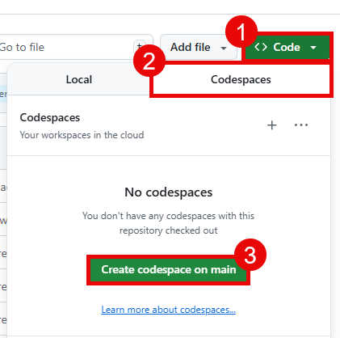
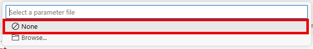

# Task 01 - Deploy a Bicep script

## Introduction

Before you can start building your AI shopping assistant, you need to deploy the necessary Azure resources. This includes setting up a resource group, deploying a Bicep script to create the required infrastructure, and configuring environment variables for your application.

## Description

In this task, you will deploy a Bicep script that sets up the necessary Azure resources for your AI shopping assistant. This includes creating a resource group and deploying the required infrastructure. In addition, you will install any software prerequisites needed for the application to run.

## Success Criteria

- You have installed software necessary for the application to run.
- You have created a resource group in Azure.
- You have deployed a Bicep script to create the necessary Azure resources.

## Learning Resources

- Cloning a repository via the [command line](https://docs.github.com/en/github/creating-cloning-and-archiving-repositories/cloning-a-repository) or [GitHub Desktop](https://docs.github.com/en/desktop/contributing-and-collaborating-using-github-desktop/cloning-a-repository-from-github-to-github-desktop)
- [az group (Azure Resource Group)](https://learn.microsoft.com/cli/azure/group?view=azure-cli-latest)
- [Create Bicep files by using Visual Studio Code](https://learn.microsoft.com/azure/azure-resource-manager/bicep/visual-studio-code?tabs=CLI)
- [Azure Developer CLI (azd)](https://learn.microsoft.com/azure/developer/azure-developer-cli/overview?tabs=linux)

## Key Tasks

### 01: Fork the repository

Fork [this GitHub repository](https://github.com/microsoft/TechWorkshop-L300-AI-Apps-and-Agents) to your account. You will need to fork the repo in order to modify and use GitHub Actions workflows in later tasks.

<details markdown="block">
<summary><strong>Expand this section to view the solution</strong></summary>

In order to fork this repository, make sure that you are signed in to GitHub with the account you would like to use. Then, select the **Fork** button.


On the next page, select your account as the Owner and leave the repository name alone. Then, select **Create fork** to complete the process.


</details>

### 01: Run Codespace or install necessary software

To work through this training, you can either use a GitHub Codespace or install the necessary software on your local machine.

To use a GitHub Codespace, navigate to your forked repository and select the **Code** button. Then, select the **Codespaces** tab and choose **Create codespace on main**.



This Codespace is pre-configured with all the necessary software to complete this training.

Alternatively, you can install the necessary software on your local machine. This includes:

- [Azure CLI](https://learn.microsoft.com/cli/azure/install-azure-cli)
- [Azure Developer CLI (azd)](https://learn.microsoft.com/azure/developer/azure-developer-cli/install-azd)
- [A Git client](https://git-scm.com/download/). An alternative option is to install [GitHub Desktop](https://desktop.github.com/).
- [Python 3.10 or later](https://www.python.org/downloads/)
- [Visual Studio Code](https://code.visualstudio.com/download)
- [The Bicep tools Visual Studio Code extension](https://marketplace.visualstudio.com/items?itemName=ms-azuretools.vscode-bicep)
- [Docker Desktop](https://www.docker.com/products/docker-desktop/) (optional, but recommended)

If you do not use a Codespace, you will also need to clone the repository to your local machine.

You can do this using the following command:

```bash
git clone https://github.com/<your-username>/TechWorkshop-L300-AI-Apps-and-Agents.git
```

Make sure to replace `<your-username>` with your actual GitHub username.

### 03: Create a resource group in Azure

After you have set up your development environment, the next step is to create a resource group in Azure.

<details markdown="block">
<summary><strong>Expand this section to view the solution</strong></summary>

You can do this using the following command in the Azure CLI, assuming you are logged in and have selected the correct subscription:

```bash
az group create --name techworkshop-l300-ai-agents --location eastus2
```

Alternatively, you may choose to do this from [the Azure portal](https://portal.azure.com/). In the search bar at the top, search for and select **Resource groups**. Then, select the **+ Create** button to create a new resource group. Choose your subscription and give the resource group a name such as `techworkshop-l300-ai-agents`.

Make sure to choose from one of the following regions for the resource group location:

- East US 2
- Sweden Central
- France Central
- Switzerland West

The reason for this is that certain Azure services used in this training are currently only available in these regions.

</details>

### 04: Deploy the Bicep script

You will use the Bicep extension in Visual Studio Code to deploy the Bicep script that sets up the necessary Azure resources for this training.

<details markdown="block">
<summary><strong>Expand this section to view the solution</strong></summary>

Open Visual Studio Code and select **File > Open Folder**. Then, navigate to the location where you cloned the repository and open that folder. Then, strike `Ctrl+Shift+P` (or `Cmd+Shift+P` on macOS) to open the command palette. In the command palette, type `Bicep: Deploy Bicep File` and select that option.


Choose the file `src/infra/DeployAzureResources.bicep` from the file dialog.


You may be prompted to sign into your Azure account. If so, follow the prompts to complete the sign-in process. Then, strike `Enter` to accept the default deployment name.


After that, you will need to select the subscription and resource group where you would like to deploy the resources. Choose the same resource group that you created in the previous step.


Finally, you will be prompted for a parameter file. Select **None** to proceed without a parameter file.



In the console window, you will find a link to the deployment in the Azure portal. You can select this link to monitor the progress of the deployment.


</details>
