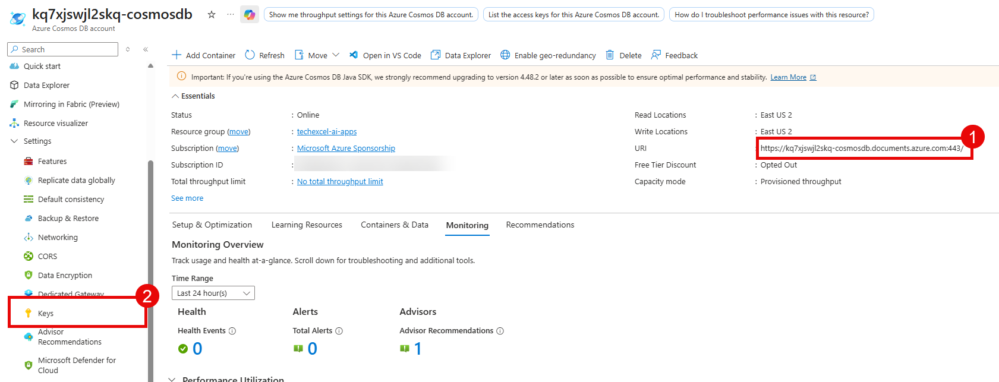
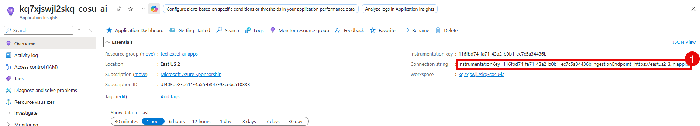

# Task 02 - Configure Azure resources

## Introduction

Now that you have deployed the necessary Azure resources, the next step is to configure these resources.

## Description

In this task, you will configure your Azure AI Foundry project and set up the necessary environment variables for your application.

## Success Criteria

- You have configured your Azure AI Foundry project.
- You have set up the necessary environment variables for your application in a .env file.

## Learning Resources

- [Deployment overview for Azure AI Foundry Models](https://learn.microsoft.com/azure/ai-foundry/concepts/deployments-overview)
- [Add a new connection to your project](https://learn.microsoft.com/azure/ai-foundry/how-to/connections-add)
- [How to create and configure your storage account for use in Azure AI Foundry Projects](https://learn.microsoft.com/azure/ai-foundry/how-to/evaluations-storage-account)

## Key Tasks

### 01: Create Azure AI model deployments

The Azure AI Foundry project that you deployed as part of the first step is now ready to be configured. You will need to set up the project to use the resources that you deployed in the previous step, as well as selecting the model deployments that you will use.

<strong>Expand this section to view the solution</strong>

Navigate to the [Azure AI Foundry](https://ai.azure.com/) and select the project that you created in the prior task.

From the **My assets** menu, select **Models + endpoints** from the list. Then, select the **+ Deploy model** button and choose **Deploy base model**.

On the **Select a model** modal dialog, enter `phi-4` in the search box and select the **Phi-4** model from the list. Then, select **Confirm** to create a Phi-4 deployment in your project.

Ensure that the deployment type is **Global Standard** and retain the name `Phi-4` for the deployment name. Finally, select **Deploy** to deploy this model.

Repeat this process for **gpt-4.1** and **text-embedding-3-small**. You will have three models in total.

### 02: Connect resources to your Azure AI Foundry project

The next step is to connect the resources that you deployed in the prior task to your Azure AI Foundry project. This includes connecting the storage account and Application Insights resource that you created in the first task.

<strong>Expand this section to view the solution</strong>

In your Azure AI Foundry project, select the **Management center** option from the left-hand menu.

Select the **Connected resources** tab on the left-hand side and then choose the **+ New connection** button.

Select the **Storage account** option from the list.

Then, navigate to the storage account that you created in the first task. Select the **Add connection** button associated with this storage account to make the connection. When you are done, select **Close** to close this modal dialog.

Select the **+ New connection** button again and this time choose the **Application Insights** option from the list.

Then, navigate to the Application Insights resource that you created in the first task. Select the **Add connection** button associated with this Application Insights resource to make the connection. When you are done, select **Close** to close this modal dialog.

### 03: Grant storage account permissions

Now that you have connected a storage account to your Azure AI Foundry project, you will need to grant the project permission to access the storage account. You will also need to grant your own user account permission to access the storage account so that you can run the code in this training.

<strong>Expand this section to view the solution</strong>

In the [Azure portal](https://portal.azure.com/), navigate to the storage account that you connected to your Azure AI Foundry project in the previous step.

Select the **Access control (IAM)** option from the left-hand menu. Then, select the **+ Add** button and choose **Add role assignment**.

Choose the **Storage Blob Data Contributor** role from the **Job function roles** list. Then, select **Members**.

Select the **Managed identity** radio button and then choose **+ Select members**.

In the flyout pane, ensure your subscription is selected. Then, select **Azure AI Foundry project** from the **Managed identity** drop-down list. Choose the Azure AI Foundry project associated with this training and then select the **Select** button at the bottom of the pane. This must be the project and not the Azure AI Foundry resource itself.

After adding the managed identity, select **User, group, or service principal** from the **Select members** pane. Then, search for your own user account and select it from the list. Finally, select the **Select** button at the bottom of the pane.

When you are back on the **Add role assignment** pane, select the **Review + assign** button twice to grant both the managed identity for your Azure AI Foundry project and your own user account the Storage Blob Data Contributor role on this storage account.

### 04: Create .env file

In order to run the code in this training, you will need to create a `.env` file in the `src` directory of the repository that you cloned in the first task. This file will contain the necessary environment variables for your application to connect to the Azure resources that you deployed and configured in the previous tasks. Use the file `src/env_sample.txt` as a template for creating your `.env` file.

<strong>Expand this section to view the solution</strong>

Copy the file `src/env_sample.txt` to a new file named `.env` in the same directory. Then, open the `.env` file in a text editor and update the values for each environment variable to match your Azure resources. For any environment variables with pre-filled values, you can leave them as they are unless you explicitly changed the names of the resources during deployment.

You will find many of these variables in the Azure AI Foundry project that you created. To find these values, navigate to the **Overview** page and review the **Endpoints and keys** section, as well as the **Project details** section to the right of it.

Then, fill in the following.

- `AZURE_OPENAI_ENDPOINT`: Copy the **Azure OpenAI endpoint** box from the **Azure OpenAI** section.
- `AZURE_OPENAI_KEY`: Copy the **API Key** box when you have selected the **Azure OpenAI** library.
- `AZURE_AI_AGENT_ENDPOINT`: Copy the **Azure AI Foundry project endpoint** when you have selected the **Azure AI Foundry** library.

For the following variables, navigate to the ***Models + endpoints** menu option from the **My assets** menu.

Then, select the appropriate model deployment that you created in the previous step and fill in the details below.

- `gpt_endpoint`: Copy the **Target URI** box from the **gpt-4.1** deployment and save everything prior to `/openai` in the URI. It should look something like `https://{YOUR_AI_FOUNDRY}.cognitiveservices.azure.com/`.
- `gpt_api_key`: Copy the **Key** box from the **gpt-4.1** deployment.

- `phi_4_endpoint`: Select **Azure AI Inference SDK** from the **SDK** drop-down list on the right-hand side. Then, copy the value for `endpoint` from the code snippet. It should look something like `https://{YOUR_AI_FOUNDRY}.services.ai.azure.com/models`.
- `phi_4_api_key`: Copy the **Key** box from the **Phi-4** deployment.

For the following variables, navigate to the [Azure Portal](https://portal.azure.com/) and open the storage account that you created in the first task. Then, navigate to the **Access keys** option from the **Security + networking** menu on the left-hand side.

- `blob_connection_string`: Copy the value for **Connection string** from the **key1** section.
- `storage_account_name`: Copy the value for **Storage account name**.

To fill in the Azure AI Search variables, navigate to the Azure AI Search service that you created in the first task. Be sure that you do **not** include any quotation marks for the Azure AI Search variables. All other variables need quotation marks surrounding the values but these should not have quotation marks surrounding the values.

- `SEARCH_ENDPOINT`: Copy the value for **Url** from the **Overview** page.
- `SEARCH_KEY`: Copy the value for **Primary admin key** from the **Keys** page.

To fill in the Cosmos DB variables, navigate to the Cosmos DB account that you created in the first task.

- `COSMOS_ENDPOINT`: Copy the value for **URI** from the **Overview** page.
- `COSMOS_KEY`: Copy the value for **PRIMARY KEY** from the **Keys** page in the **Settings** menu.

For the following variable, navigate to the Application Insights resource that you created in the first task.

- `APPLICATIONINSIGHTS_CONNECTION_STRING`: Copy the value for **Connection string** from the **Overview** page.

