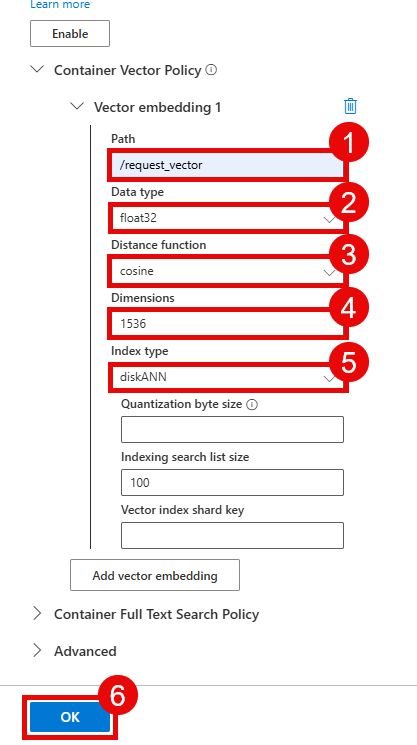
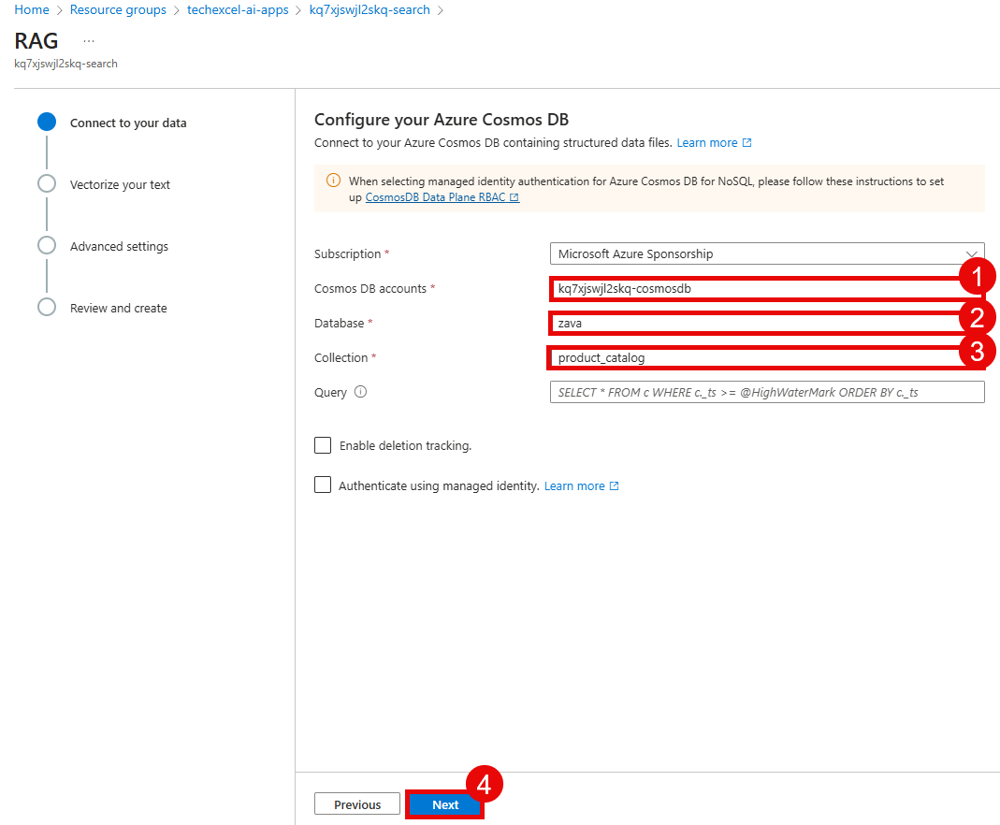
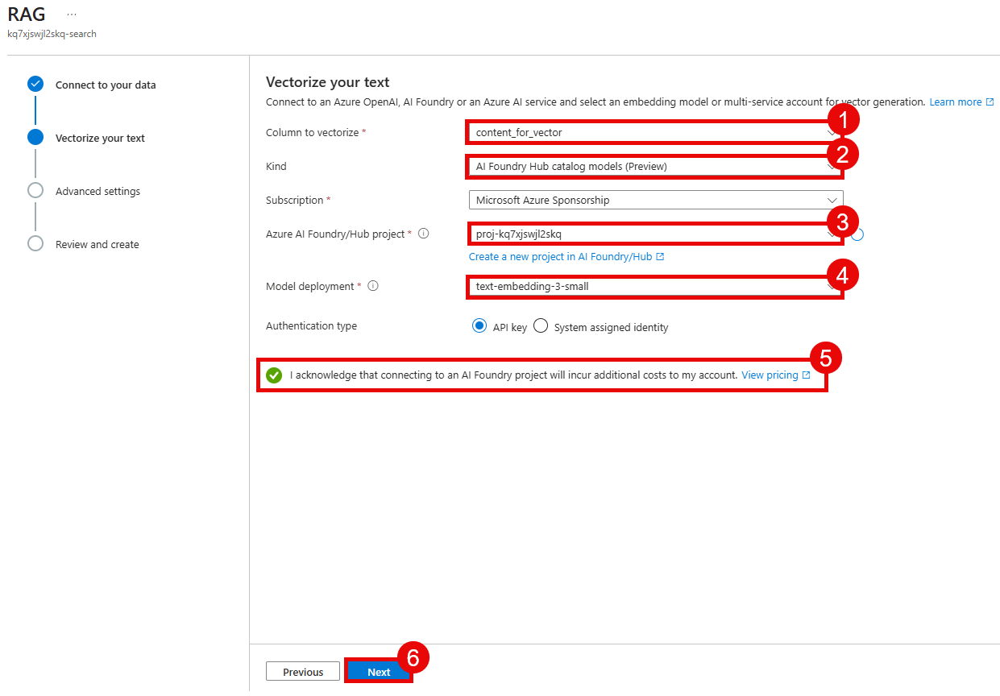

# Task 03 - Prepare datasets

## Introduction

Now that you have deployed and configured the necessary Azure resources, the next step is to prepare the datasets that you will use in this training. In this scenario, Zava has product catalog data in Cosmos DB. We will then use Azure AI Search to create a search index and import the data from Cosmos DB.

## Description

In this task, you will prepare the dataset needed for the rest of this training. This includes loading data into Cosmos DB and creating a Azure AI Search index to import the data.

## Success Criteria

- You have loaded data into Cosmos DB.
- You have created a search index in Azure AI Search and imported data into it.

## Learning Resources

- [Create a container in Azure Cosmos DB for NoSQL](https://learn.microsoft.com/azure/cosmos-db/nosql/how-to-create-container)
- [Import data wizards in the Azure portal](https://learn.microsoft.com/azure/search/search-import-data-portal)

## Key Tasks

### 01: Create a Cosmos DB container

The data that you will use in this training is located in `src/data/updated_product_catalog(in).csv`. This CSV file contains product catalog data for Zava, including product names, descriptions, categories, prices, and image URLs. You will load this data into the Cosmos DB instance that you created in the first task of this exercise.

<details markdown="block">
<summary><strong>Expand this section to view the solution</strong></summary>

Navigate to the [Azure portal](https://portal.azure.com/) and open the Cosmos DB account that you created in the first task of this exercise.

Before you can create the container that you will use for this training, you will need to enable vector search for the Cosmos DB NoSQL API. To do so, navigate to the **Settings** section of your Cosmos DB account and select **Features**. Then, select the **Vector Search for NoSQL API** option.


Select the **Enable** button to enable vector search. This may take up to 15 minutes for the policy to become active.


After vector search has been enabled, navigate to the **Data Explorer** section of your Cosmos DB account from the left-hand menu. In the Data Explorer, you can see a `zava` database that was created as part of the deployment process. Select the ellipsis (...) next to the `zava` database and choose **New Container**.


In the **New Container** pane, ensure that the database ID is `zava` and enter `product_catalog` for the container ID. Then, enter `/ProductID` for the partition key. Set the container throughput to **Manual** and enter `400` RU/s.


Scroll down to the **Container Vector Policy** section and select **Add vector embedding**. Name the new vector embedding `/request_vector` and ensure that it is a **float32** data type with a distance function of **cosine** and `1536` dimensions. For the index type, choose **diskANN**. Then, select the **OK** button to create the container.



</details>

### 02: Create a virtual environment and install dependencies

Before you can run the script to load data into Cosmos DB, you should create a Python virtual environment. This will allow you to install the necessary Python packages without affecting your global Python installation.

<details markdown="block">
<summary><strong>Expand this section to view the solution</strong></summary>

Open a terminal and navigate to the root directory of the repository that you cloned in the first task. Then, run the following commands to create a virtual environment and activate it:

```bash
# Navigate to the /src/ directory
cd src

# Create a virtual environment
python -m venv venv

# Activate the virtual environment
# On Windows
venv\Scripts\activate.bat
# On Windows (PowerShell)
venv\Scripts\Activate.ps1
# On macOS/Linux
source venv/bin/activate
```

Once the virtual environment is activated, you can install the necessary dependencies using pip:

```bash
pip install -r requirements.txt
```

</details>

### 03: Import data into the Cosmos DB container

Now that you have created the Cosmos DB container, the next step is to import the product catalog data into the container. There is a Python script in `src/pipelines/ingest_to_cosmos.py` that you can use to load the data from the CSV file into the Cosmos DB container.

<details markdown="block">
<summary><strong>Expand this section to view the solution</strong></summary>

Use the same terminal window where you created and activated the virtual environment in the previous step. Ensure that you are still in the `src` directory of the repository and that your virtual environment is active. Then, run the following command to execute the ingestion script:

```bash
python src/pipelines/ingest_to_cosmos.py
```

</details>

### 04: Confirm that the data was imported

After the ingestion script has completed, you can confirm that the data was successfully imported into the Cosmos DB container by using the Data Explorer in the Azure portal.

<details markdown="block">
<summary><strong>Expand this section to view the solution</strong></summary>

Navigate to the [Azure portal](https://portal.azure.com/) and open the Cosmos DB account that you created in the first task of this exercise. Then, navigate to the **Data Explorer** section from the left-hand menu.

In the Data Explorer, you should see the `zava` database. Inside of it is the `product_catalog` container that you created earlier. You can expand the container to view the imported data.

Select the **Items** option under the `product_catalog` container to view the documents that were imported. You should see multiple documents representing the products in the catalog.


</details>

### 05: Create an Azure AI Search index and import data

The final step in preparing the dataset is to create an Azure AI Search index and import the data from the Cosmos DB container into the search index. This will allow you to use Azure AI Search to query the product catalog data.

<details markdown="block">
<summary><strong>Expand this section to view the solution</strong></summary>

Navigate to the [Azure portal](https://portal.azure.com/) and open the Azure AI Search service that you created in the first task. Then, select the **Import data (new)** option from the central menu.


Choose **Azure Cosmos DB** from the list of data sources.


Select **RAG** as the scenario to target.


In the **Connect to your data** menu section, choose your Cosmos DB account from the drop-down list. Then, select the **zava** database and the **product_catalog** container. After that, select **Next** to continue.



On the **Vectorize your text** page, select `content_for_vector` from the drop-down list as the column to vectorize. Then, choose **AI Foundry Hub catalog models** as the **Kind** and select your Azure AI Foundry project from the drop-down list. In the **Model deployment** drop-down list, choose `text-embedding-3-small`. After that, tick the checkbox indicating that connecting to an AI Foundry project will incur additional costs and select **Next** to continue.



Leave the **Advanced settings** page with the default settings and select **Next** to continue.

For the **Objects name prefix**, enter `zava-product-catalog`. Then, select **Create** to import the data.

After the import process is complete, navigate to the **Indexes** section from the **Search management** menu. You should see a new index named `zava-product-catalog`. Select this index to view its details and confirm that there are 54 documents in the index.


</details>
