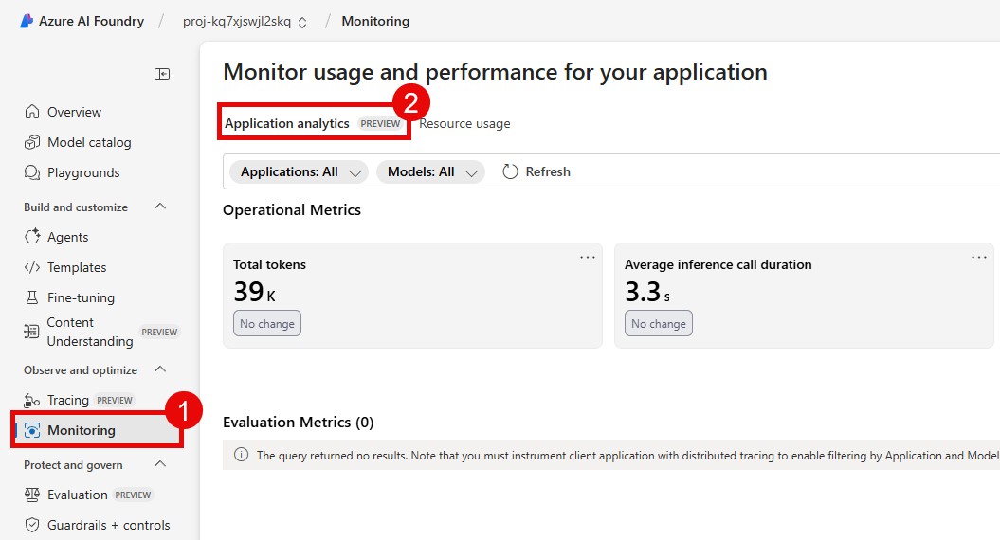

# Task 03 - Monitoring in Azure AI Foundry

## Introduction

Over the prior two tasks in this exercise, you have reviewed the default monitoring capabilities available in Azure AI Foundry and instrumented your client application with the OpenTelemetry SDK to capture detailed trace information. This information can be valuable to Zava as they look to monitor the performance and usage of their deployed AI models. However, the default Application analytics dashboard may not provide all of the insights that Zava needs. To address this, a variety of customizations are available, including custom metrics and alerts.

## Description

In this task, you will customize the Application analytics dashboard in Azure AI Foundry to better suit your monitoring needs. You will also set up alerts for specific metrics to ensure that you are notified of any issues that may arise.

## Success Criteria

- You have customized the Application analytics dashboard.
- You have set up alerts for specific metrics.

## Learning Resources

- [Monitor Azure OpenAI](https://learn.microsoft.com/azure/ai-foundry/openai/how-to/monitor-openai)
- [Monitor your generative AI applications](https://learn.microsoft.com/azure/ai-foundry/how-to/monitor-applications)
- [Monitor Azure AI Foundry Agent Service](https://learn.microsoft.com/azure/ai-foundry/agents/how-to/metrics)

## Key Tasks

### 01: Review an existing query in the Application analytics dashboard

Before you customize the Application analytics dashboard, it is a good idea to review one of the existing queries to understand how it works. This will help you when you create your own custom queries later in the task.

<details markdown="block">
<summary><strong>Expand this section to view the solution</strong></summary>

First, navigate to [Azure AI Foundry](https://ai.azure.com) and select the AI project associated with this training. Then, select **Monitoring** from the **Observe and optimize** menu on the left-hand side. Ensure that you are in the **Application analytics** tab.



This dashboard contains a variety of widgets that display different metrics related to your deployed models. Each widget is based on a query that is executed against the Application Insights resource connected to your AI Foundry project.

To view the query behind a widget, select the ellipsis (...) in the upper-right corner of the widget and then select **Open query link**. Use this to open the query behind the **Total tokens** widget.


Selecting this link will open the Application Insights resource in a new browser tab and display more detail. The starting point is a view of the query results. On the left-hand side, you can select the **Tables** icon to view the available set of tables. You can select the **User Query** button in the top menu to switch the view from results to the query itself. All queries are written in Kusto Query Language (KQL).

</details>

### 02: Edit the dashboard in Application Insights

Now that you have reviewed an existing query, you can customize the Application analytics dashboard to better suit your monitoring needs. You can delete widgets that are not relevant, move widgets around to change the layout, and add new widgets based on custom queries.

<details markdown="block">
<summary><strong>Expand this section to view the solution</strong></summary>

Return to the **Application analytics** tab in Azure AI Foundry. Then, scroll to the bottom of the page and select the **View in Azure Monitor Application Insights** link.


This will open the Application analytics dashboard as an Application Insights workbook. In this workbook, you can modify the dashboard to better suit your needs. Select the **Edit** button in the top menu to enter edit mode.


In edit mode, you will be able to modify queries, move widgets, add new widgets, and delete existing widgets. First, scroll to the bottom of the page and observe the **User Feedback** widget. This widget requires user feedback to be enabled in the client application, which the sample chat application does not do. For that reason, you can safely delete this widget. Select the ellipsis (...) in the upper-right corner of the widget and then select **Delete**.


Next, move the **Evaluation Metrics** widget down to the bottom of the page. You can do this by moving your mouse to the edge of the widget until the move cursor appears. Then, select and drag the widget to the desired location.


One easy way to add a new widget is to duplicate an existing widget and then modify the query. For this example, you will duplicate the **Token usage** widget and then modify the query to show a grid with error messages instead. Select the ellipsis (...) in the upper-right corner of the **Token usage** widget and then select **Clone**.


This will create a new copy of the Token usage widget directly below the original. Next, select the **Edit** button in the upper-right corner of the first instance of **Token usage** widget to modify it.

In the Editing modal dialog, replace the existing query with the following query, which will return a grid of error messages.

```kql
traces
| where severityLevel >= 3
| project message, timestamp, severityLevel, customDimensions["code.file.path"], customDimensions["code.function.name"], customDimensions["code.line.number"]
```

Then, change the **Visualization** to **Grid**. Run the query using the **Run Query** button. Rename the query from "Token usage" to `Error Messages` using the name box in the center of the modal dialog. Finally, select **Done editing** to save your changes. You should now see the **Error Messages** widget in the dashboard.


Finally, select **Done Editing** to exit edit mode. You can then select **Save** to save this as a new workbook.

{: .note }
> Saving a new workbook will not overwrite the existing Application analytics dashboard. Instead, it will create a new workbook in the Application Insights resource. You can always return to the original Application analytics dashboard by navigating to the **Monitoring** page in Azure AI Foundry and selecting the **Application analytics** tab.

</details>

### 03: Set up an alert

Alerts can help you stay informed about potential issues with your deployed models. You can create alert rules based on specific metrics, such as error rates or response times. When an alert is triggered, you can choose to be notified via email, SMS, or other methods. In this step, you will create an alert when the total number of tokens used in an hour exceeds a certain threshold. This is a useful alert to have in place, as it can help you monitor your usage and avoid unexpected costs.

<details markdown="block">
<summary><strong>Expand this section to view the solution</strong></summary>

Return to the **Monitoring** page in Azure AI Foundry. Then, ensure you are on the **Application analytics** tab. Select the ellipsis on the **Total tokens** widget and select the **Open query link** option to return to the Application Insights resource.

In the query window, select the ellipsis (...) in the top menu and then select **New alert rule**.


This will open the **Create an alert rule** page and pre-populate many of the fields. Scroll down to the **Measure** box and select **final_total_tokens** from the list of available metrics. Then, change the **Aggregation granularity** to **1 hour**. In the **Alert logic** section, set the value of **Threshold value** to `1000`, a number low enough to generate alerts during regular application usage. You may also set the **Frequency of evaluation** to a smaller figure, such as **5 minutes**. This will reduce the amount of time you need to wait before receiving an alert e-mail. After that, select **Next: Actions >** to continue.


{: .note }
> You are setting this threshold low to ensure that you receive an alert during the testing phase. In a production environment, you would likely set this threshold much higher based on your expected usage. Also, when creating an alert, be aware of the combination of frequency of evaluation, aggregation granularity, and the time frame for your metric. Because the original metric query looks at seven days worth of data, the actual value of the metric will be higher than the traffic you have generated over the past hour. For the purposes of this demonstration, that is okay, but in a real-world scenario, you would want to ensure that your alerting conditions are based on the same time frame as your metric.

In the **Use quick actions** menu, enter an action group name and display name. Also, make sure that your email address is selected in the **Email** section. Then, select **Save** to continue.


In the **Actions** tab, you should see the action group that you just created. Enter a subject for the e-mail you wish to send, such as `Warning: High Token Utilization`. Select **Next: Details >** to continue.


For the **Alert rule name** field, enter `High Token Use`. Leave the **Severity** set to `3 - Informational`. Then, select **Review + create** to continue.

Review the results and then select **Create** to create this alert rule.


To test the rule, make sure that the sample chat application is running and then generate some traffic by sending several messages to the chat interface. Within several minutes, the alert should fire and you should receive an e-mail.

To review the alert details, navigate to your **Application Insights** resource in the Azure portal. Then, select **Alerts** from the **Monitoring** menu on the left-hand side. Here, you should see the alert that you just created. You can select the alert to view more details, including the history of when the alert has fired. Select the alert link.


On the right-hand fly-out pane, you can see more details about the alert, including the condition that triggered the alert, including the value of the metric when the alert fired. Select **Go to alert rule** to view the alert rule details.


On the alert rule page, select **Disable** from the top menu to disable the alert rule. This will prevent you from receiving additional e-mails as you continue through the exercises in this training.


</details>
